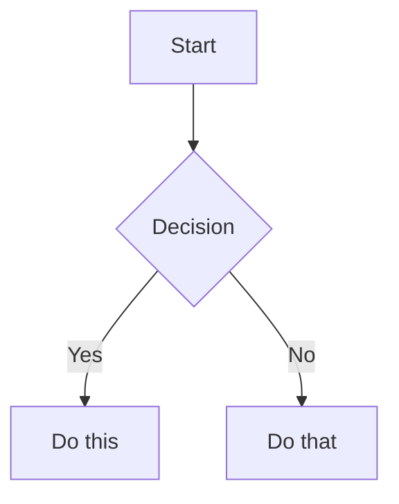

# Mermaid syntax — Absorbed from kepano

Verbatim extract of kepano `obsidian-skills` `skills/obsidian-markdown/SKILL.md` §Diagrams (Mermaid). See `kepano-sync.json` for sync metadata and `scripts/sync-kepano.sh` for the re-sync workflow.

<!-- KEPANO-BEGIN: obsidian-markdown SKILL.md §Diagrams (Mermaid) @sha:fa1e131 -->
<!-- kepano-sync: see kepano-sync.json for body_sha256 + drift status -->

## Diagrams (Mermaid)

````markdown

````

To link Mermaid nodes to Obsidian notes, add `class NodeName internal-link;`.

<!-- KEPANO-END: obsidian-markdown SKILL.md §Diagrams (Mermaid) -->
