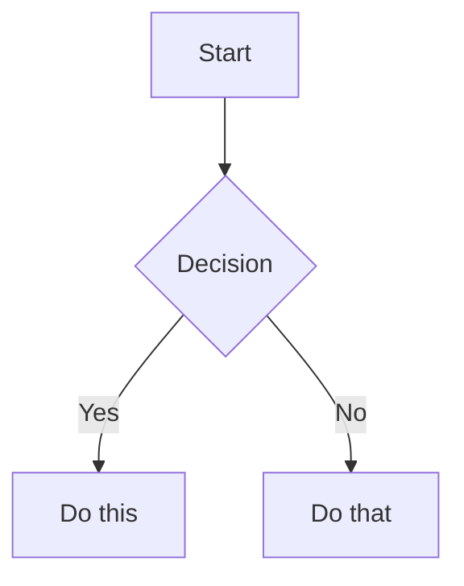

# Mermaid in Obsidian

Adapted from kepano/obsidian-skills@fa1e131. See `docs/refreshing-kepano.md`.

````markdown

````

To link Mermaid nodes to Obsidian notes, add `class NodeName internal-link;`.

