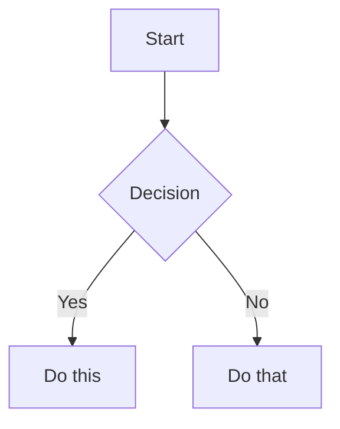

# Markdown Syntax — Reference Card

Adapted from kepano/obsidian-skills@fa1e131. See docs/refreshing-kepano.md.

<!-- kepano-sync: see kepano-sync.json for body_sha256 + drift status -->

## Internal Links (Wikilinks)

| Syntax | Purpose | Note |
|--------|---------|------|
| `[[Note Name]]` | Link to note | Renames tracked auto |
| `[[Note Name\|Display Text]]` | Custom display text | Pipe separator |
| `[[Note Name#Heading]]` | Link to heading | Cross-note header refs |
| `[[Note Name#^block-id]]` | Link to block | See block refs below |
| `[[#Heading in same note]]` | Same-note header link | Single hash prefix |

**Block refs:** append `^block-id` to any paragraph. For lists/quotes, place on separate line after block.

## Embeds

| Syntax | Purpose |
|--------|---------|
| `![[Note Name]]` | Embed full note |
| `![[Note Name#Heading]]` | Embed section |
| `![[image.png]]` | Embed image |
| `![[image.png\|300]]` | Embed with width |
| `![[document.pdf#page=3]]` | Embed PDF page |

See [EMBEDS.md](references/EMBEDS.md) for audio, video, search embeds.

## Callouts

```markdown
> [!note]
> Basic callout.

> [!warning] Custom Title
> Callout with custom title.

> [!faq]- Collapsed by default
> Foldable (- collapsed, + expanded).
```

Common types: `note`, `tip`, `warning`, `info`, `example`, `quote`, `bug`, `danger`, `success`, `failure`, `question`, `abstract`, `todo`. See [CALLOUTS.md](references/CALLOUTS.md) for full list.

## Properties (Frontmatter)

```yaml
title: My Note
date: 2024-01-15
tags:
  - project
  - active
aliases:
  - Alternative Name
cssclasses:
  - custom-class
```

See [PROPERTIES.md](references/PROPERTIES.md) for all types. Tags searchable; aliases improve link suggestions.

## Inline Tags

```markdown
#tag                    Simple tag
#nested/tag             Hierarchy via slash
```

Letters, numbers (not first char), underscores, hyphens allowed. Can also define in frontmatter `tags` property.

## Comments

```markdown
This is visible %%but this is hidden%% text.

%%
This entire block hidden in reading view.
%%
```

## Highlighting

```markdown
==Highlighted text==
```

## Math (LaTeX)

```markdown
Inline: $e^{i\pi} + 1 = 0$

Block:
$$
\frac{a}{b} = c
$$
```

## Diagrams (Mermaid)

````markdown

````

Link nodes to notes: add `class NodeName internal-link;` in diagram.

## Footnotes

```markdown
Text with a footnote[^1].

[^1]: Footnote content.

Inline footnote.^[This is inline.]
```

## References

- [Obsidian Flavored Markdown](https://help.obsidian.md/obsidian-flavored-markdown)
- [Internal links](https://help.obsidian.md/links)
- [Embeds](https://help.obsidian.md/embeds)
- [Callouts](https://help.obsidian.md/callouts)
- [Properties](https://help.obsidian.md/properties)
